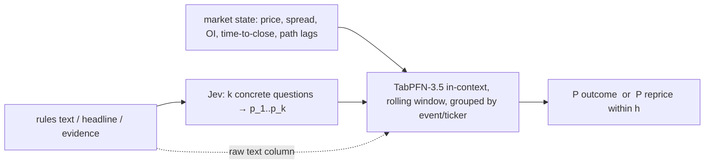

# LOG-011 — Brainstorm: Jev as feature extractor, TabPFN as learner, on Kalshi and stock-news panels

Date: 2026-10-02. **Nothing was run.** This log records hypotheses, prior evidence, kill
conditions and the proposed order of experiments before any score is produced. It does
not supersede LOG-010's CPI recommendation; it is a parallel candidate track that reuses
existing JevTrader data and asks a question LOG-010 cannot: whether TabPFN adds value as
the *learner on top of* a cheap semantic feature extractor, rather than as a forecaster
of a macro series.

## Trigger

User brainstorm combining three inputs:

1. [Chat 003](../chats/003-explain-probability-calibration.md): calibration vs discrimination;
   learn `p_custom = f(p_Jev, x)`; Jev as an amortized prior with `logit P = logit p_Jev + g(x)`;
   several Jev probabilities as a latent feature vector `(p_1..p_k, x) → P(Y)`; online
   recalibration `f_t` as the distribution drifts.
2. Prior Labs cookbook ["When agents should use Jev vs. TabPFN?"](https://docs.priorlabs.ai/cookbook/tabpfn-vs-jev)
   (read 2026-10-02): fake-job-posting detection, 300 test rows. Jev with its 44-example
   context limit: AUC 0.8883, Brier 0.1006, mean predicted risk 27.5% against a 5.0% base rate
   (overconfident). TabPFN-3.5-Plus with 400 rows: AUC 0.9485, Brier 0.0262; with 17,567 rows:
   AUC 0.9995, Brier 0.0074. Lesson: Jev is context-bound; TabPFN learns across all rows.
   This is one dataset chosen by the vendor; it is not evidence about financial/event data.
3. The user's idea: repeatedly snapshot Kalshi markets over time into a wide tabular panel,
   learn an "autoregressive" prediction function with TabPFN, and use it to calibrate or
   better leverage Jev on Kalshi; ask whether a variant works for stocks.

## What JevTrader already established (documented past results, not re-measured)

Source: `/home/david/code/davidsvaughn/cedar/JevTrader/docs/log/`, read-only; scout
summary at `agent://JevTraderScout` during this session. Log numbers below are JevTrader's.

| Track | Documented result | Status there |
|---|---|---|
| K2 contract-semantics bias (log 007) | Liquid text-lane books, 13,975 markets / 1,871 events, 24 h before close: favorites −1.1 c, longshot-NO −3.6 c per contract after fee. Ask Brier 0.012 Entertainment, 0.015 data prints, 0.026 Elections, **0.148 Mentions/live speech**. One marginal positive cell (+3.7 c, interval +0.3 to +6.9). | Closed as a strategy; labels kept as features |
| K5 Jev as forecaster (log 008) | 244 earnings-call mention markets, 16 companies, 14-day headlines, 24 h before close: Jev Brier 0.310, market mid 0.181, constant 0.250, 0.25/0.75 blend 0.190. Twelve largest misses were company vocabulary with zero matching headlines. | Dead as "Jev versus market"; **explicitly alive as "Jev plus specific evidence versus market"** (log 008 line 47) |
| K4 repricing lag (log 007) | 400 announcement markets, 81 informative moves, 32 completed to 0.97: lag p25 7 min, median 20, p75 38, p90 206. Prize at move start median 0.64. | Alive; blocked on an evidence feed |
| S1 news activity (logs 006/014/020) | Jev question set on Benzinga headlines + context: AUC 0.761 CV 2025, 0.725 out-of-time 2026 (context-only 0.688 / 0.660). Isotonic recalibration improved Brier 0.168→0.122 (2025), 0.194→0.141 (2026, map fit on 2025). | Kept, "settled result" |
| Direction / sign (logs 010/022) | 53–55% hit; short pocket untradable after halts/Rule 201. | Killed |
| Question sets (TODO.md) | Abstract nouls flat at 0.3–0.85; novelty noul 0.93–0.98 regardless; Loop 3 kept 0 of 12 proposed questions. | v2 with concrete questions pending |

Downstream learners used there were logistic regression and gradient boosting plus
isotonic calibration. **No tabular foundation model was used anywhere in JevTrader.**

Existing reusable data (gitignored in JevTrader; counts from `docs/DATA-SOURCES.md` and
JevTrader logs, not re-counted today):

- `data/exp013/events.parquet` 75,907 rows (2025) and `events_2026.parquet` 47,480 rows,
  with Jev `p_*/score_*/conf_*` features, pre-event context, and 30-minute activity labels.
  `received_at_utc` is synthesized from news `created_at`; log abnormal returns, not simple.
- `data/exp005/settled_snapshots.jsonl` 22,920 raw rows (97 duplicate tickers), five fixed
  horizons; raw **hourly** candles per market in `data/exp005/candles/<ticker>.json`
  (bid/ask OHLC, price, open interest). 1-minute candles for ~400 announcement markets in
  `data/exp011/candles_1m/`. Text lane only; Economics/Financials excluded; historical
  API cutoff 2026-07-25; 429s at 6 workers.
- `data/exp006/settled_events_classified.jsonl`: 2,249 events with Jev K1 labels.
- **No repeated snapshots of open markets exist.** One open-universe dump (125,837 markets,
  2026-09-23). alpha-claw's Kalshi collector was stood down 2026-08-07; AGENTS forbids
  restarting collectors for a data investigation.

## Assessment of the brainstorm

### Claim 1 — "snapshot Kalshi over time into a panel"

Mostly reconstructable from cached candles: a (market, hour) panel of price/bid/ask/OI
across the life of ~22.7k settled markets is a parsing job. A live snapshotter only adds
what candles do not record: order-book depth (executability) and the **contemporaneous
evidence state** at time t. Evidence cannot be backfilled without hindsight contamination
(AGENTS research invariant), so it must be captured prospectively and accrues slowly.
Decision: build the panel from existing candles first; treat prospective evidence capture
as insurance against hindsight, not immediate statistical proof.

### Claim 2 — "learn an autoregressive function with TabPFN"

TabPFN is not natively autoregressive. The honest framing is direct multi-horizon tabular
prediction on lagged features, which is what TabPFN-TS does; Thinking mode documents
`group_col` / `group_time_col` for grouped temporal rows (`tabpfn-client` ≥ 0.6.0, hosted
only). The target decides whether this is worth anything:

- Target = final outcome given state at t: competes with the market price, which K2 found
  near-sufficient on liquid books. Many weakly relevant columns against ~1.9k independent
  events, with threshold markets correlated inside events, is an overfitting setup.
  Prior: null except in Mentions/live-speech cells (ask Brier 0.148).
- Target = "repricing of ≥10 c, or reaching 0.97, within h hours": this is K4 restated as
  a learning problem, nobody has built it, and path features plausibly carry information.
  Its payoff is a prioritizer for where evidence search spends budget, not a trade.

### Claim 3 — "calibrate Jev better for Kalshi"

Correction to this session's first verbal verdict ("dead"): what K5 killed is **Jev as a
context-free forecaster**. The documented failure mode was missing evidence (zero matching
headlines, company vocabulary), one fixed blend, 16 companies, 244 contracts. That does
not establish absent discrimination in general, and log 008 leaves "Jev plus specific
evidence" open. What remains true: a calibration map cannot create discrimination that
is not in the inputs (chat 003's own caveat), so any calibrator test must put evidence
in Jev's state and compare against the market on the same contracts.

A second correction: a rolling in-context TabPFN window gives cheap **adaptation** to drift
(the chat's `f_t`), not calibration. Calibration is an empirical property measured by
held-out proper scores and reliability curves; LOG-009 already showed TabPFN's own
intervals undercovering on CPI. Every arm below reports Brier, log loss and a reliability
table on grouped chronological holdouts.

## The germ worth testing

The division of labor — Jev compresses text into a few probabilities, a learner with
many rows maps `(p_1..p_k, market state, path lags) → P(Y)` — is JevTrader's thesis and
chat 003's architecture, but every prior test used GBM/logistic as the learner. TabPFN is
the untested substitution, with one structural fit: refitting is just choosing the context
window, so an adaptive calibrator costs no training (KV cache for repeated predictions).

## Proposed experiments (not launched)

Ordered by cost and information. All are research-scored; no trading or market-return
claim. TabPFN weights are non-commercial; LimiX restricts commercially motivated research.

### A. Stocks: S1 activity model with TabPFN as the learner

- Data: JevTrader `exp013` 2025 events (train/CV) and 2026 events (out-of-time), existing
  Jev features and 30-minute activity label. Zero Jev cost. Local TabPFN with
  `SUBSAMPLE_SAMPLES` on the RTX 3080; resource checks per AGENTS before each fit.
- Arms: (1) GBM on Jev + context features, documented 0.761 / 0.725 AUC as the reference,
  re-run on the identical cohort; (2) TabPFN on the same matrix; (3) TabPFN on raw headline
  text + context **without** Jev features (TabPFN-3.5 handles text columns natively);
  (4) arm 2 + raw text. Arm 3 vs 2 answers the cookbook's question on our distribution:
  does Jev's semantic compression add anything over native text handling?
- Metrics: AUC, Brier, log loss, reliability table by decile; isotonic-on-top as a
  control to see whether TabPFN's native probabilities need it. Day-grouped CV as in
  JevTrader; 2026 held out entirely.
- Effect worth detecting: ≥0.02 AUC or ≥5% Brier on 2026 with a day-block bootstrap
  interval excluding zero. Smaller: record as null.
- Known limits: synthesized receipt clock; survivor/news-selected ticker universe;
  activity ≠ direction, so no P&L.

### B. Kalshi: residual-vs-market on settled text-lane markets

- Data: `exp005` snapshots deduplicated by ticker (explicit reconciliation audit first),
  liquid-book filter as in K2, K1 labels joined by `event_ticker`, `rules_primary` as a
  text column.
- Target: outcome. Features: ask/bid/mid at 24 h, spread, OI, volume, life_hours,
  category, series, K1 labels, rules text. Grouped chronological holdout by event.
- Score against the ask's own Brier per category. Kill: no category where TabPFN beats
  the ask with an event-block interval excluding zero. Expected null on liquid cells;
  the run is cheap and gives an uncontaminated real-event calibration test of TabPFN.

### C. Kalshi: "about to reprice" panel

- Rebuild the hourly (market, t) panel from cached candles; 1-minute where available.
- Label: ≥10 c move or reach 0.97 within h ∈ {1, 6, 24} hours. Features: lagged price,
  spread, OI, volume deltas, time-to-close, K1 mechanism labels, category.
- Learner: TabPFN with grouped temporal columns (hosted Thinking) or local TabPFN with
  explicit lag features; GBM as the baseline.
- Scored by Brier/AUC and precision at the top decile; event-grouped holdout. Kill
  condition inherited from K4: if the top decile does not concentrate completed
  repricings beyond the base rate with an interval excluding zero, drop.
- Payoff: a prioritizer for the log-025 evidence crawler; not a trade.

### D. Kalshi: evidence-conditioned Jev calibrator (prospective only)

- The only arm that tests chat 003's `f(p_Jev, x)` as intended. Requires evidence in
  Jev's state at decision time, captured prospectively and timestamped; retrospective
  evidence is excluded. Accrues slowly; design after A–C.

## Decisions

- Record these as hypotheses now; no scores exist. Do not treat JevTrader's numbers as
  reproduced until re-run on identical cohorts.
- A is first: existing data, defined out-of-time holdout, no collector, no new access.
- LOG-010's CPI gate stays independent; this track does not replace it.

## Next steps

1. **Peer review of this log** before any run. Reviewer checks: are JevTrader results
   quoted correctly, are the kill conditions falsifiable, is the independent-event
   accounting right, is anything here a silent substitution of an easier problem.
2. **Protocol for A** (`scripts/` entrypoint, not yet written): freeze cohort hashes for
   `exp013` 2025/2026 parquet files, the feature list per arm, the activity label
   definition, day-grouped CV folds, the 2026 holdout, metrics, bootstrap blocks, and the
   effect threshold above. Confirm JevTrader's parquet columns and label definition by
   reading `exp013_archive_pipeline.py`/`exp019_sign_model.py` rather than the scout summary.
3. **Resource check and dry run of A**: `uptime`, `free -h`, `nvidia-smi`, `df`; GBM arm
   first on the frozen cohort to reproduce the documented reference numbers; then TabPFN
   arms with subsampling. Commit and push after the protocol, after the GBM reproduction,
   and after each TabPFN arm.
4. **B and C** only after A reports, in that order; each gets its own protocol section
   and a deduplication audit of `settled_snapshots.jsonl` before training.
5. **D** is deferred until a timestamped prospective evidence capture exists; do not
   backfill evidence.
