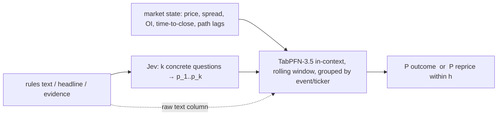

# LOG-011 — Brainstorm: Jev as feature extractor, TabPFN as learner, on Kalshi and stock-news panels

Date: 2026-10-02. **Nothing was run.** This log records hypotheses, prior evidence, kill
conditions and the proposed order of experiments before any score is produced. It does
not supersede LOG-010's CPI recommendation and does not lift LOG-010's pause; it is a
candidate *supporting engineering check* (AGENTS: equity/event pilots support, they do not
organize) that reuses existing JevTrader data and asks a question LOG-010 cannot: whether
TabPFN adds value as the learner on top of a cheap semantic feature extractor.

Revision history: first version pushed as `5f4ed92`; this version incorporates an
independent review (`local://log-011-review.md`, 2026-10-02) that source-checked every
quoted number. Corrections are marked **[corrected]**.

## Trigger

User brainstorm combining three inputs:

1. [Chat 003](../chats/003-explain-probability-calibration.md): calibration vs discrimination;
   learn `p_custom = f(p_Jev, x)`; Jev as an amortized prior with `logit P = logit p_Jev + g(x)`
   (the chat itself says "prior" is an analogy, not a formal Bayesian prior); several Jev
   probabilities as a latent feature vector `(p_1..p_k, x) → P(Y)`; online recalibration
   `f_t` as the distribution drifts; three out-of-sample baselines (raw Jev, 1-D
   isotonic/beta, contextual calibrator).
2. Prior Labs cookbook ["When agents should use Jev vs. TabPFN?"](https://docs.priorlabs.ai/cookbook/tabpfn-vs-jev)
   (read 2026-10-02): fake-job-posting detection, 300 test rows, 15 frauds. Jev with the
   44 examples that fit *this 16-field representation and prompt* in a 32k context
   **[corrected: not a general 44-example limit]**: AUC 0.8883, Brier 0.1006, mean predicted
   risk 27.5% against a 5.0% base rate. Hosted TabPFN-3.5-Plus with 400 rows: AUC 0.9485,
   Brier 0.0262; with 17,567 rows: 0.9995 / 0.0074. This is an unequal-training-size vendor
   comparison on one dataset, not evidence about financial/event data, and the Plus hosted
   text processing is not identical to local 3.5 text handling.
3. The user's idea: repeatedly snapshot Kalshi markets over time into a wide tabular panel,
   learn an "autoregressive" prediction function with TabPFN, and use it to calibrate or
   better leverage Jev on Kalshi; ask whether a variant works for stocks.

## What JevTrader already established (documented past results, not re-measured)

Source: `/home/david/code/davidsvaughn/cedar/JevTrader/docs/log/` and `scripts/`, read-only.
`J` prefix = JevTrader log number. Nothing below was re-run.

| Track | Documented result | Status there |
|---|---|---|
| K2 contract-semantics bias (J007:9–29) | Liquid text-lane books (spread ≤ 6 c at 24 h), 13,975 markets / 1,871 event tickers: favorites −1.1 c, longshot-NO −3.6 c per contract after fee. Ask Brier 0.012 Entertainment, 0.015 data prints, 0.026 Elections, **0.148 Mentions/live speech**. One marginal positive cell (+3.7 c, interval +0.3 to +6.9; its stated count "173 markets in 598 events" is internally inconsistent — do not use for power). | Closed as a strategy; labels kept as features |
| K5 Jev as forecaster (J008:24–47) | 244 earnings-call mention markets, 16 companies, rules + 14-day headlines in state, 24 h before close: Jev Brier 0.310, market mid 0.181, constant-0.5 0.250, 0.25/0.75 blend 0.190. Twelve largest misses were company vocabulary; **most [corrected: not all]** had zero matching headlines. | Dead as "Jev versus market"; **explicitly alive as "Jev plus specific evidence versus market"** (J008:47) |
| K4 repricing lag (J007:31–50) | 400 candidates, 81 informative, 32 completed to 0.97: lag p25 7 min, median 20, p75 38, p90 206. Median prize (1 − executable price) 0.64. **Original kill condition: median lag < 60 s** (J007:47). Selection is retrospective and outcome-sided: `exp011_repricing_speed.py` selects on final volume (:58), uses only the last 72 h of 1-min candles (:67–73), picks the eventual winning side (:80). | Alive; blocked on an evidence feed; its cohort is not a prospective training set |
| S1 news activity gate (J014:28–34, J020:16–26) | **Logistic regression [corrected: not GBM]** on context + Jev features; label `y = abs(ar_30) > 0.01` (exp013:340). Day-grouped CV 2025 sample (19,109 items): 0.761 vs context-only 0.688; full 2025: 0.759 / 0.687; out-of-time 2026 (72,595 train / 45,050 test): 0.725 / 0.660. Context feature set differs between runs (2 features in exp013:347, 4 incl. pre-returns in exp022:36). GBM was used only for the sign model (exp022:87). | Kept |
| Isotonic calibration (J014:77, J020:30) | Brier 0.168→0.122 (2025, 43 walk-forward weeks) and 0.194→0.141 (2026, map fit on 2025) calibrate **`score_materiality/3` alone**, not the gate; isotonic on the gate changed Brier 0.1136→0.1146 (no improvement) **[corrected]**. | — |
| Direction / sign (J010:65,83; J022:9,102–104) | 53–55% hit; short pocket untradable after halts/Rule 201. | Killed |
| Question sets (J015:10–16; `TODO.md`:5–9) | Loop 3 question discovery kept 0 of 12 proposed questions; abstract K1 nouls flat at 0.3–0.85; novelty noul 0.93–0.98 regardless. TODO calls for Kalshi v2 **and news v3**. | pending |

Downstream learners used there: logistic regression (gate), gradient boosting (sign),
isotonic calibration. No documented use of any tabular foundation model in JevTrader.

### Existing reusable data (gitignored in JevTrader; counts from docs, not re-counted)

- News events: `data/exp013/events.parquet` 75,907 rows (2025), `events_2026.parquet`
  47,480 rows. **[corrected]** These hold reactions/context only; Jev answers live in
  separate `labels*.jsonl`, flattened and joined by `exp013_archive_pipeline.py:335–340`
  (excluding `market_move_report` items — a Jev-dependent cohort filter) into
  `labelled_events*.parquet` (:377). Scored cohorts were 72,595 / 45,050. `received_at_utc`
  is synthesized from news `created_at` (exp013:85); returns are log abnormal returns
  (exp019:20–22). Archived Jev labels were generated retrospectively; archived text may
  include later edits.
- Kalshi settled snapshots: `data/exp005/settled_snapshots.jsonl` 22,920 rows, 22,823
  unique tickers (97 excess rows **[corrected: not 97 distinct duplicated tickers]**);
  five fixed horizons 1/6/24/72/168 h carried forward from the last ended hourly candle
  (exp005:32–54); raw hourly candles cached per market (`data/exp005/candles/<ticker>.json`,
  bid/ask OHLC, price, OI). **Row `volume` is settled lifetime `volume_fp` (exp005:104),
  `last_price`, `expiration_value` and `snap_close` are post-outcome: all are leakage for
  any pre-close model.** K1 labels (`exp006`, 2,249 events) are retrospective and their
  representative contract is selected by final volume (exp006:52–60).
- Later inventory (`docs/DATA-SOURCES.md:58`): 8,955 markets with a valid two-sided 24 h
  mid and binary outcome across 1,583 event tickers — a different denominator from K2's
  ask-based 13,975 / 1,871. Do not mix them.
- 1-minute candles for ~400 announcement markets (`data/exp011/candles_1m/`), selected as
  described under K4 above.
- Text lane only; Economics/Financials excluded (`jevtrader/kalshi.py:48–52`); 2026-07-25
  is the live/historical API tier boundary (J001:57), not the oldest obtainable history;
  429s at 6 workers.
- Repeated open-market snapshots: **none maintained in JevTrader [corrected]**. One
  open-universe dump (125,837 markets, 2026-09-23). alpha-claw retains a frozen Kalshi
  ticker/trade/lifecycle WebSocket spool for 2026-08-02–08-07 (~5.4 GB) with receipt times;
  its collector was stood down 2026-08-07 and AGENTS forbids restarting it.
- Prospective evidence seed **[corrected: exists]**: J013 (`exp016`) captured evidence,
  Jev judgments and live quotes for 175 markets on 2026-09-23. Small, unaudited, but not
  "no capture exists".

## Assessment of the brainstorm

### Claim 1 — "snapshot Kalshi over time into a panel"

Mostly reconstructable from cached candles: a (market, hour) panel of price/bid/ask/OI
across the life of ~22.7k settled markets is a parsing job. A live snapshotter only adds
what candles do not record: order-book depth (executability) and the **contemporaneous
evidence state** at time t. Evidence cannot be backfilled without hindsight contamination
(AGENTS research invariant), so it must be captured prospectively and accrues slowly.
Decision: build the panel from existing candles first; audit the existing 175-market
evidence seed and the alpha-claw spool before designing any new capture.

### Claim 2 — "learn an autoregressive function with TabPFN"

TabPFN is not natively autoregressive. The honest framing is direct multi-horizon tabular
prediction on lagged features, which is what TabPFN-TS does. Thinking mode documents
`group_col` / `group_time_col` for grouped temporal rows (`tabpfn-client` ≥ 0.6.0; hosted
or enterprise, not the local-weights API; `group_col` and `time_col` are mutually exclusive).
**[corrected]** Those columns do not implement the outer chronological split or label
purging, and Thinking fits consume compute/tokens — "no gradient retraining" is not "no
fitting cost". The target decides whether this is worth anything:

- Target = final outcome given state at t: competes with the market price, which K2 found
  near-sufficient on liquid books. Many weakly relevant columns against ~1.6–1.9k event
  tickers (not proven independent occurrences), with threshold markets correlated inside
  events, is an overfitting setup. Prior: null except Mentions/live-speech (ask Brier 0.148).
- Target = first passage to a repricing within h hours: K4 restated as a learning problem.
  Nobody has built it; path features plausibly carry information. Payoff is a modest
  prioritizer for evidence search — price movement alone does not establish that useful
  evidence will be found.

### Claim 3 — "calibrate Jev better for Kalshi"

Correction to this session's first verbal verdict ("dead"): what K5 killed is Jev as an
**evidence-poor** forecaster (headlines and rules were supplied, but mostly without the
relevant information). That does not establish absent discrimination in general, and
J008:47 leaves "Jev plus specific evidence" open. What remains true: a calibration map
cannot create discrimination absent from the inputs (chat 003's own caveat), so any
calibrator test must put evidence in Jev's state and compare against the market on the
same contracts. Only arm D below does that.

A second correction: a rolling in-context TabPFN window gives cheap **adaptation** to
drift (the chat's `f_t`), not calibration. Calibration is measured by held-out proper
scores and reliability tables. **[corrected]** LOG-009's 80%-interval coverage of 72.0%
on 75 later CPI events belongs to the *shared trailing-residual wrapper around TabPFN point
predictions*, not to TabPFN's native predictive distribution (LOG-009:56, LOG-010:37);
it says nothing about native probability calibration. Every arm below reports Brier, log
loss and a reliability table on past-only grouped holdouts, with the chat's simple
calibration controls included.

## The germ worth testing

The division of labor — Jev compresses text into a few probabilities, a learner with many
rows maps `(p_1..p_k, market state, path lags) → P(Y)` — is JevTrader's thesis and chat
003's architecture, but every prior test used logistic/GBM as the learner. TabPFN is the
untested substitution, with one structural property worth checking rather than assuming:
standard in-context inference refits by choosing the context window (no gradient
training), so an adaptive calibrator is cheap to *run*; whether it is *calibrated* is an
empirical question.

## Proposed experiments (not launched; each needs its own protocol and the gate below)

All are research-scored; no trading or market-return claim. TabPFN weights are
non-commercial; LimiX restricts commercially motivated research. Hosted TabPFN requires a
separate upload-authorization decision (AGENTS: no private datasets to hosted services
without authorization); default is local inference.

### A. Stocks: S1 activity gate with TabPFN as the learner

Discloses its substitution: this predicts **activity, not direction** — an engineering
test of learners on semantic features, not evidence for macro forecasting or profitable
stock decisions.

- Data: `labelled_events*.parquet` for 2025 and 2026 after the exp013 eligibility filter
  (freeze hashes of source parquet, `labels*.jsonl`, and the joined cohort; freeze the label
  `abs(ar_30) > 0.01`). Report unique news IDs, ticker-days, days, and overlapping
  30-minute windows, not just rows. Zero Jev cost. Local TabPFN with `SUBSAMPLE_SAMPLES`
  on the RTX 3080; AGENTS resource checks before each fit.
- Step 0, provenance: reproduce the documented **logistic** gate numbers on the identical
  cohort with its original (non-chronological) GroupKFold, reported separately and only as
  a provenance check — never as the comparison protocol.
- Comparison protocol **[corrected]**: past-only expanding or rolling day/week folds
  (pattern: `exp018_online_calibration_and_threshold.py:68–87`), labels resolved before the
  decision, encoders/calibrators fit on earlier folds only. 2026 is an **already-inspected
  historical out-of-time benchmark** (J020), not untouched prospective confirmation; label
  it exploratory.
- Arms on identical eligible rows: (0) training-rate climatology; (1) logistic, context
  only / Jev only / context + Jev; (2) GBM on context + Jev; (3) TabPFN on context + Jev;
  (4) TabPFN on context + **matched as-of text** (headline, summary, body, publisher, prior
  headlines — the same inputs Jev saw per exp013:294–296) without Jev features; (5) arm 3 +
  matched text. The primary comparison is **5 vs 4** (incremental Jev value given the same
  text) with 3 vs 2 secondary (learner value given Jev features). A headline-only variant,
  if run, is an ablation and is named as such. Disclose that every "no-Jev" arm still
  inherits the Jev-dependent `market_move_report` cohort exclusion.
- Excluded inputs: `p_active_oof`, any post-event return/volume column, the historical
  non-chronological gate output.
- Metrics: primary paired Brier (relative reduction) on the 2026 holdout; secondary AUC,
  log loss, reliability by decile; materiality-only isotonic as a control (the documented
  0.122/0.141 numbers are that control, not the gate). Day-block bootstrap intervals with
  a multi-day-block sensitivity. Report pre-moved vs non-pre-moved slices.
- Effect worth detecting: ≥5% relative paired Brier reduction (primary) or ≥0.02 absolute
  AUC, with a 90% day-block interval excluding zero; one primary arm/metric, the rest
  reported as secondary. Failing to reach it is **not** evidence of equivalence. Estimate
  the noise scale from development-fold predictions before claiming the holdout can
  resolve it.
- Known limits: synthesized receipt clock; retrospective Jev labels and possibly edited
  text (hindsight not cured by the synthetic clock); news-selected ticker universe.

### B. Kalshi: outcome vs market on settled text-lane markets

Not a Jev calibration test: it estimates outcome from quotes and contract descriptors.
Beating the ask may be spread correction, not new information.

- Data: `exp005` snapshots after an explicit duplicate reconciliation (first-row vs
  last-row disagreement between exp007:41–48 and DATA-SOURCES:60), liquid-book filter,
  K1 labels joined by `event_ticker`, `rules_primary` as a text column. **Drop `volume`,
  `last_price`, `expiration_value`, `snap_close` (post-outcome).** Audit whether other
  metadata (rules version, close time) is as-of or final. K1 labels are retrospective and
  volume-selected; say so in the result.
- Comparators on the same cohort: raw ask; raw mid on valid two-sided books; market-only
  logistic/isotonic calibration of the mid; GBM on the same features; TabPFN.
- Prespecified primary cell: Mentions/live speech (the only category with residual, ask
  Brier 0.148). All other categories are secondary with family-wise adjustment. Kill: no
  prespecified-cell improvement over market-only calibrated probability with an
  event-block interval excluding zero and a minimum 5% relative Brier gain.

### C. Kalshi: first-passage repricing panel

- Rebuild the hourly (market, t) panel from cached candles using ended candles only;
  past-only deltas. 1-minute archive used only with its disclosed outcome-sided selection
  and never with outcome-side predictors (no eventual-winning-side features).
- Label, to be frozen in the protocol before any score: first passage of the **absolute**
  mid move ≥ 10 c within one horizon (start with h = 6 h), excluding rows already ≥ 0.97
  or ≤ 0.03, with end-of-life censoring handled explicitly and missing candles reported.
  This is a *new* kill metric, not K4's (median lag < 60 s). Reaching 0.97 is a separate
  secondary label.
- Baselines: past-only base rate; price/time-to-close/persistence rule; logistic; GBM.
  TabPFN local with explicit lags (hosted Thinking group columns only after the hosted
  authorization gate).
- Event-grouped, time-purged holdout; train outcomes settled before each test decision;
  per-event and per-row scores. Kill: top-decile lift over the simple rule baseline with an
  event-block interval excluding zero; 32 historical completions in two months is too few
  to promise a precise interval, so report the achievable precision first.

### D. Kalshi: evidence-conditioned Jev calibrator (prospective)

The only arm that tests chat 003's `f(p_Jev, x)` as intended, and the arm that J008:47 left
open. Start by auditing the existing 175-market `exp016` seed (receipt time, raw evidence,
rules/version, model/prompt, quotes, outcome availability, shared events). Protocol to
freeze before accrual: target, cutoff, independent-event minimum, baselines (raw market,
market-only calibration, raw Jev, 1-D Platt/beta/isotonic, evidence-free vs evidence-added
ordinary learners, TabPFN), practical score effect, stopping rule. No collector restart;
no retrospective evidence.

## Decisions

- Record these as hypotheses now; no scores exist. JevTrader numbers are documented
  history until reproduced on identical cohorts.
- Preferred first arm: A, after the gate below. It has the best ready-data/cost case, not
  the strongest prior of a foundation-model advantage.
- B is contaminated as first drafted (lifetime volume) and only runs after the leakage
  fixes above; C has an unfrozen label; D needs an accrual/scoring protocol.
- LOG-010's CPI gate and pause stay independent; this track does not replace it.

## Next steps

1. **Authorization gate.** LOG-010 says experiments remain paused and LOG-009's next steps
   are not permission to resume inference. Running arm A requires an explicit user go-ahead
   in a later session; this log is not that permission.
2. **Protocol for A** (new `scripts/` entrypoint, not yet written), after the gate: read
   `exp013_archive_pipeline.py` and `exp022_out_of_time_2026.py` directly for the label,
   eligibility filter and feature lists; freeze cohort hashes, the six arms, the past-only
   fold scheme, purge rules, the primary 5-vs-4 comparison, the effect threshold and the
   bootstrap blocks. Commit and push the protocol before any fit.
3. **Provenance reproduction**: resource checks (`uptime`, `free -h`, `nvidia-smi`, `df`),
   then the logistic gate on the frozen cohort under its original GroupKFold, reported as
   provenance only. Commit and push.
4. **Chronological comparison**: arms 0–5 under the past-only protocol; TabPFN arms with
   subsampling; commit and push after each arm; record nulls.
5. **B and C** only after A reports, each with its own protocol section, the B leakage
   fixes, the duplicate reconciliation, and C's frozen label.
6. **D**: audit the `exp016` seed and the alpha-claw spool read-only; design accrual and
   scoring; do not restart collectors or backfill evidence.
